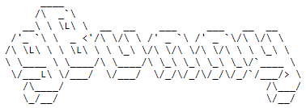

<p align="center">
  <a href="" rel="noopener">
 </a>
</p>

<p align="center"> Simpler and faster git interactions.
    <br>
    <br>
</p>

<div align="center">

[]()
[](/LICENSE)

[]()
  <a href="https://www.npmjs.com/package/vue-tasty-burgers" target="_brlak">
      
  </a>

</div>

---


## 📝 Table of Contents

- [📝 Table of Contents](#-table-of-contents)
- [🧐 About <a name = "about"></a>](#-about)
- [🏁 Getting Started <a name = "getting_started"></a>](#-getting-started)
    - [How to install](#how-to-install)
- [🎈 Usage <a name="usage"></a>](#-usage)
- [⛏️ Built Using <a name = "built_using"></a>](#️-built-using)
- [✍️ Authors <a name = "authors"></a>](#️-authors)
- [🎉 Acknowledgements <a name = "acknowledgement"></a>](#-acknowledgements)

## 🧐 About <a name = "about"></a>

<p> <strong>gBunny</strong> is a set of commands, along with a <strong>REPL</strong> environment, to enhance the interaction with git in your favourite shell (<code>bash</code>, <code>zsh</code>, <code>powershell</code> etc...).
    <br>
</p>


## 🏁 Getting Started <a name = "getting_started"></a>

<strong>gBunny</strong> requires:
<ul>
  <li><a href="https://nodejs.org/en/" target="_blank">Node.js <code>>= 10.0.0</code></a> (older versions might work too but they are not tested)</li>
  <li><a href="https://git-scm.com/" target="_blank">Git</a></li>
</ul>

#### How to install

```
npm install -g git-bunny
```

## 🎈 Usage <a name="usage"></a>

Add notes about how to use the system.


## ⛏️ Built Using <a name = "built_using"></a>

- [TypeScript](https://www.typescriptlang.org/) - Web Framework
- [NodeJs](https://nodejs.org/en/) - Server Environment

## ✍️ Authors <a name = "authors"></a>

- [@imfaber](https://github.com/kylelobo) - Idea & development

## 🎉 Acknowledgements <a name = "acknowledgement"></a>

Inspired by
 - [SCM Breeze](https://github.com/scmbreeze/scm_breeze)
 - [Git-NumberedAdd](https://github.com/itenium-be/Git-NumberedAdd)
